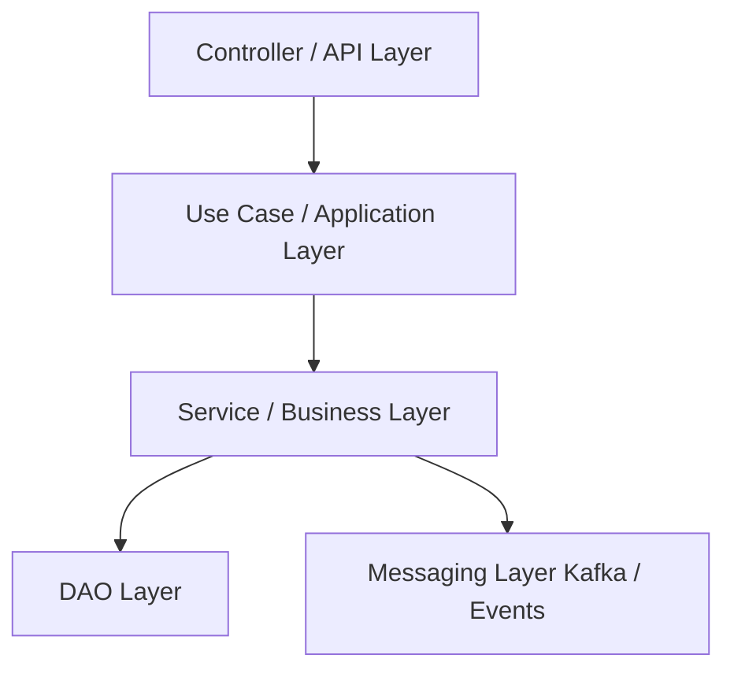

# Diseño de software - Spring Boot
Este repositorio contiene buenas prácticas y un **diseño de referencia** para microservicios o proyectos desarrollados con **Spring Boot**, usando **REST** y/o **Kafka**, y repositorios de base de datos.

## 1. Capas internas de un microservicio
Se recomienda separar responsabilidades claramente para mantener el código **modular, testable y mantenible**.

### **Descripción de cada capa**
| Capa | Responsabilidad |
|------|----------------|
| **Controller** | Recibe la petición REST o evento Kafka, valida y sanitiza datos simples (indirectamente), devuelve el objeto a los Use Cases. |
| **Use Case** | Orquesta flujos de negocio que pueden involucrar varios servicios. Representa una acción completa del negocio. |
| **Service** | Contiene la lógica de negocio pura. |
| **DAO Layer** | Encapsula el acceso a los repositories, mapeos de DTOs/Events a Entities y lógica relacionada con persistencia (logs, auditoría, métricas). |
| **Repository** | Acceso CRUD a la base de datos usando Spring Data u otras implementaciones. Su función es ejecutar la consulta exclusivamente. |
| **Producer** | Produce eventos Kafka para integración asíncrona entre microservicios. |
| **Mapper** | Transformación entre diferentes representaciones: Entities, DTOs y Events. Cada mapper se centra en un **objeto principal** para mantener claridad. |
| **Validator** | Verificar que los datos cumplen ciertas reglas y si no la cumple maneja la excepción. |
| **Factory** | Creación y configuración compleja de un objeto. |
| **Utils / Utility** | Funciones estáticas y genéricas que pueden ser usadas en cualquier capa. |



---

## 2. Flujo de una petición REST
1. **Controller recibe el request**
   - Validaciones básicas (`@NotNull`, `@Email`, `@Size`).
   - Sanitización ligera (trim, mayúsculas/minúsculas).

2. **Use Case ejecuta el flujo de negocio completo**
   Orquesta las acciones para un caso de uso (Servicios, validaciones, mapeos...).

3. **Service aplica lógica de negocio**
   - Cálculos, reglas de negocio, persistencia.

4. **DAO persiste datos**
   - Convierte DTOs a Entities usando mappers.
   - Guarda en el Repository y realiza logging/auditoría si corresponde.

5. **Repository realiza operaciones en la base de datos**

6. **Messaging Layer publica eventos**
   - Kafka, RabbitMQ u otro broker según arquitectura.

7. **Controller devuelve la respuesta al cliente**

## 3. Detalles de las capas
### Use Cases
Son útiles cuando un flujo de negocio involucra **varios Services**. Si solo se necesita un Service, el Use Case puede ser trivial o incluso omitido. Ejemplo:  

```java
public class CreatePaymentUseCase {

    public PaymentResult execute(CreatePaymentCommand command) {
        validator.validate(command);
        Payment payment = factory.create(command);
        paymentDAO.save(payment);
        commissionCalculator.apply(payment);
        eventPublisher.publish(payment);
        return mapper.toResult(payment);
    }
}
```

### Mappers
Un mapper por objeto principal (Entity, DTO, Event). Métodos específicos dentro de cada mapper, indicando claramente a qué se mapea. Ejemplo:

```java
public class UserEntityMapper {
    public UserDTO toUserDTO(UserEntity entity) { ... }
    public UserEvent toUserEvent(UserEntity entity) { ... }
}
```

Ventajas:
* Claridad sobre origen y destino de cada mapeo.
* Modularidad y testabilidad.
* Generación incremental según necesidades del flujo de negocio.

### DAO Layer (Repository Wrapper)
Encapsula repositorios y mappers, y añade lógica relacionada con persistencia (logs, auditoría, métricas). Evita que los Services hagan demasiadas cosas. Ejemplo:

```java
public class UserDAO {
    private final UserRepository userRepository;
    private final UserEntityMapper mapper;

    public UserDTO save(UserDTO dto) {
        UserEntity entity = mapper.toEntity(dto);
        UserEntity saved = userRepository.save(entity);
        log.info("User saved: {}", saved.getId());
        return mapper.toDTO(saved);
    }
}
```

El Service llama al DAO para persistencia y mapeo, mientras se centra en la lógica de negocio.

### Validators
Validán reglas de negocio complejas, reglas que pueden cambiar con el tiempo. Ejecutan comprobaciones previas a la ejecución del flujo.

No deben llamar a repositorios directamente (salvo reglas justificadas).

```java
public class PaymentValidator {
    public void validate(CreatePaymentCommand command) {
        ...
    }
}
```

### Factories
Construyen entidades y objetos complejos. Es buena practica usar patrón builder.

```java
public class PaymentFactory {
    public Payment create(CreatePaymentCommand command) {
        return new Payment(
            UUID.randomUUID().toString(),
            command.accountId(),
            command.amount(),
            Instant.now()
        );
    }
}
```

## Utils
No contienen lógica de negocio y no dependen de servicios ni DAOs. Pueden usarse en librerias internas para ser compartidas.
```java
public class DateUtils {
    private DateUtils() {} // evitar instanciación

    public static String formatLocalDateTime(LocalDateTime dateTime) {
        return dateTime.format(DateTimeFormatter.ISO_DATE_TIME);
    }

    public static LocalDateTime parseISO(String isoString) {
        return LocalDateTime.parse(isoString, DateTimeFormatter.ISO_DATE_TIME);
    }
}
```

## 4. Beneficios de esta arquitectura
* Claridad y separación de responsabilidades
* Mantenibilidad y escalabilidad
* Testabilidad independiente de cada capa
* Flexibilidad para cambios en DB, messaging o mappers
* Servicios delgados, Use Cases coordinadores, DAOs encapsulando persistencia

## 5. Buenas prácticas
* Mantener Controllers delgados.
* Servicios centrados en **reglas de negocio** y **procesos individuales**.
* Use Cases para **flujos complejos** que involucran varios Services. Evitar Strategy Pattern como punto de entrada.
* DAO Layer para **persistencia**, **mapeos** y **lógica relacionada**.
* Mappers específicos por objeto, con métodos claros de origen → destino.
* Log, auditoría y métricas dentro de DAOs o componentes dedicados.
* Los microservicios deben crecer **verticalmente** (cohesión de negocio), no horizontalmente.

Esta estructura sirve como guía para desarrollar microservicios Spring Boot limpios, escalables y fáciles de mantener en proyectos de alta complejidad.
