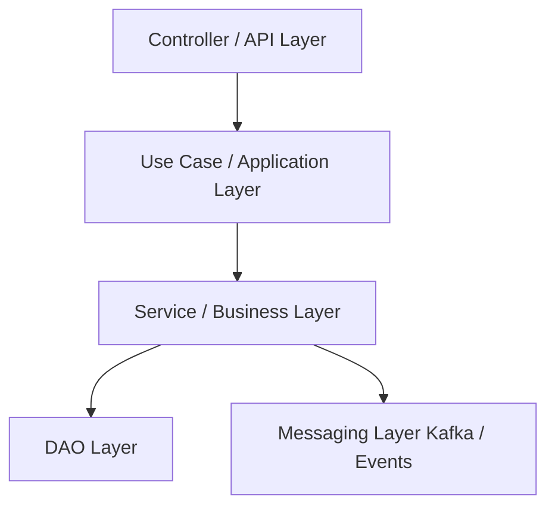

# Diseño de Microservicios - Spring Boot
Este repositorio contiene buenas prácticas y un **diseño de referencia** para microservicios desarrollados con **Spring Boot**, usando **REST** y/o **Kafka**, y repositorios de base de datos.

---

## 1. Capas internas de un microservicio
Se recomienda separar responsabilidades claramente para mantener el código **modular, testable y mantenible**.

### **Descripción de cada capa**
| Capa | Responsabilidad |
|------|----------------|
| **Controller** | Recibe la petición REST o evento Kafka, valida y sanitiza datos simples, convierte DTOs y llama a los Use Cases. |
| **Use Case** | Orquesta flujos de negocio que pueden involucrar varios Services y DAOs. Representa una acción completa del negocio. |
| **Service** | Contiene la lógica de negocio pura, reglas de validación complejas, transformaciones de datos y orquestación parcial de acciones. |
| **DAO Layer** | Encapsula el acceso a los repositories, mapeos a Entities/DTOs/Events y lógica relacionada con persistencia (logs, auditoría, métricas). |
| **Repository** | Acceso CRUD a la base de datos usando Spring Data u otras implementaciones. |
| **Messaging Layer** | Produce o consume eventos Kafka para integración asíncrona entre microservicios. |
| **DTOs / Mappers** | Transformación entre diferentes representaciones: Entities, DTOs y Events. Cada mapper se centra en un **objeto principal** para mantener claridad. |



---

## 2. Flujo de una petición REST
1. **Controller recibe el request**  
   - Validaciones básicas (`@NotNull`, `@Email`, `@Size`).  
   - Sanitización ligera (trim, mayúsculas/minúsculas).  
   - Conversión a objeto interno o DTO.  

2. **Use Case ejecuta el flujo de negocio completo**  
   - Llama a uno o varios Services según sea necesario.  
   - Orquesta acciones, manejo de errores y eventos.  

3. **Service aplica lógica de negocio**  
   - Validaciones complejas.  
   - Transformaciones de datos, cálculos y reglas de negocio.  

4. **DAO persiste datos**  
   - Convierte DTOs a Entities usando mappers.  
   - Guarda en el Repository y realiza logging/auditoría si corresponde.  

5. **Repository realiza operaciones en la base de datos**  

6. **Messaging Layer publica eventos**  
   - Kafka, RabbitMQ u otro broker según arquitectura.  

7. **Controller devuelve la respuesta al cliente**  

---

## 3. Uso de Use Cases
Los **Use Cases** son útiles cuando un flujo de negocio involucra **varios Services**. Si solo se necesita un Service, el Use Case puede ser trivial o incluso omitido. Ejemplo:  

```java
public class ProcessPaymentUseCase {
    private final AccountService accountService;
    private final PaymentService paymentService;
    private final NotificationService notificationService;

    public PaymentResult execute(PaymentRequest request) {
        accountService.validateFunds(request);
        Payment payment = paymentService.createPayment(request);
        notificationService.publishPaymentApproved(payment);
        return PaymentResult.from(payment);
    }
}
```

## 4. Estrategia de Mappers
Un mapper por objeto principal (Entity, DTO, Event). Métodos específicos dentro de cada mapper, indicando claramente a qué se mapea. Ejemplo:

```java
public class UserEntityMapper {
    public UserDTO toUserDTO(UserEntity entity) { ... }
    public UserEvent toUserEvent(UserEntity entity) { ... }
}
```

Ventajas:
* Claridad sobre origen y destino de cada mapeo.
* Modularidad y testabilidad.
* Generación incremental según necesidades del flujo de negocio.

## 5. DAO Layer (Repository Wrapper)
Encapsula repositorios y mappers, y añade lógica relacionada con persistencia (logs, auditoría, métricas). Evita que los Services hagan demasiadas cosas. Ejemplo:

```java
public class UserDAO {
    private final UserRepository userRepository;
    private final UserEntityMapper mapper;

    public UserDTO save(UserDTO dto) {
        UserEntity entity = mapper.toEntity(dto);
        UserEntity saved = userRepository.save(entity);
        log.info("User saved: {}", saved.getId());
        return mapper.toDTO(saved);
    }
}
```

El Service llama al DAO para persistencia y mapeo, mientras se centra en la lógica de negocio.

## 6. Beneficios de esta arquitectura
* Claridad y separación de responsabilidades
* Mantenibilidad y escalabilidad
* Testabilidad independiente de cada capa
* Flexibilidad para cambios en DB, messaging o mappers
* Servicios delgados, Use Cases coordinadores, DAOs encapsulando persistencia

## 7. Buenas prácticas
* Mantener Controllers delgados: solo validación y conversión de datos.
* Servicios centrados en **reglas de negocio** y **procesos individuales**.
* Use Cases para **flujos complejos** que involucran varios Services.
* DAO Layer para **persistencia**, **mapeos** y **lógica relacionada**.
* Mappers específicos por objeto, con métodos claros de origen → destino.
* Log, auditoría y métricas dentro de DAOs o componentes dedicados.

Esta estructura sirve como guía para desarrollar microservicios Spring Boot limpios, escalables y fáciles de mantener en proyectos de alta complejidad.

## 8. Diseño de Use Cases
Los Use Cases representan **acciones de negocio completas** y actúan como **orquestadores del flujo**.

Reglas:
- Un Use Case = una intención clara del negocio.
- No contiene lógica técnica (HTTP, Kafka, DB).
- No contiene lógica compleja inline.
- Delegan cada acción a Services, DAOs o componentes especializados.

El método `execute()` debe ser **altamente legible**, idealmente una línea por acción.

```java
public class CreatePaymentUseCase {

    public PaymentResult execute(CreatePaymentCommand command) {
        validator.validate(command);
        Payment payment = factory.create(command);
        paymentDAO.save(payment);
        eventPublisher.publishPaymentCreated(payment);
        return mapper.toResult(payment);
    }
}
```

## 9. Evitar Strategy Pattern como punto de entrada
El patrón Strategy **no debe usarse como entrada principal del microservicio**.

Problemas:
- Oculta la intención de negocio.
- Dificulta trazabilidad y testing.
- Mezcla selección técnica con lógica de negocio.

Alternativa recomendada:
- Use Cases explícitos por acción de negocio.
- La variabilidad se maneja **dentro del dominio**, no en la entrada.

## 10. Estrategia de Testing

### Pirámide de testing recomendada
- Tests unitarios:
  - Use Cases
  - Services
  - Validators / Factories
- Contract tests:
  - REST (OpenAPI + tests)
  - Eventos Kafka (schema + payload)
- Tests de integración:
  - DAO + Repository
  - Infraestructura real (DB, Kafka testcontainers)

### Reglas
- Ningún microservicio expone endpoints sin contrato.
- Cambios en contratos deben romper tests, no producción.
- Los Use Cases deben ser testeables sin levantar Spring.

## 11. Uso responsable de programación reactiva
La programación reactiva **solo debe usarse cuando aporta valor real**.

Usar reactivo cuando:
- I/O intensivo
- Streams de datos
- Alta concurrencia no bloqueante

No usar reactivo cuando:
- Flujos simples request/response
- Operaciones CRUD sin carga
- Complejidad añadida sin beneficio medible

Regla:
> Si no puedes justificarlo con métricas, no lo uses.

## 12. Crecimiento de microservicios
Los microservicios deben crecer **verticalmente** (cohesión de negocio), no horizontalmente.

Se debe evitar:
- Crear microservicios por feature.
- Duplicar lógica de negocio en varios servicios.

Se recomienda:
- Un microservicio por dominio claro.
- Use Cases múltiples dentro del mismo servicio.

## 13. Helpers de apoyo al Use Case
Los Use Cases deben ser **orquestadores del flujo**, no contenedores de lógica detallada.
Para ello, delegan responsabilidades específicas en **helpers especializados**, inyectados como dependencias.

Estos helpers permiten:
- Mantener el Use Case extremadamente legible.
- Reutilizar lógica entre distintos Use Cases.
- Facilitar el testing unitario de cada responsabilidad.
- Evitar Services o Use Cases sobredimensionados.

### Validators
Responsabilidad:
- Validaciones de negocio complejas.
- Reglas que pueden cambiar con el tiempo.
- Comprobaciones previas a la ejecución del flujo.

No deben:
- Acceder a infraestructura.
- Llamar a repositorios directamente (salvo reglas justificadas).

```java
public class PaymentValidator {
    public void validate(CreatePaymentCommand command) {
        validateAmount(command);
        validateCurrency(command);
    }
}
```

### Factories
Responsabilidad:
- Construcción de entidades o agregados.
- Garantizar invariantes del dominio.
- Centralizar la lógica de creación.

Beneficio:
- El Use Case no “sabe” cómo se construye un objeto.

```java
public class PaymentFactory {
    public Payment create(CreatePaymentCommand command) {
        return new Payment(
            UUID.randomUUID().toString(),
            command.accountId(),
            command.amount(),
            Instant.now()
        );
    }
}
```

### Mappers
Responsabilidad:
- Transformar entre capas (DTO ↔ Domain ↔ Event).
- No contienen lógica de negocio.

Regla:
- Un mapper por objeto principal.

### Policy / Rule Objects
Responsabilidad:
- Encapsular reglas de decisión complejas.
- Evitar `if/else` grandes en Services o Use Cases.

Ejemplos:
- Cálculo de comisiones.
- Decisión de elegibilidad.
- Selección de comportamiento por reglas de negocio (NO Strategy técnica).

```java
public class CommissionPolicy {
    public BigDecimal calculate(Payment payment) {
        // reglas complejas aquí
    }
}
```

### Calculators
Responsabilidad:
- Cálculos financieros.
- Fechas, intereses, penalizaciones.

Beneficio:
- Testabilidad aislada.
- Evita lógica matemática dispersa.

### Builders
Responsabilidad:
- Construcción incremental de objetos complejos.
- Evitar constructores gigantes.

Nota:
- Preferir Factories cuando sea posible.

### Domain Services
Responsabilidad:
- Lógica de negocio que involucra múltiples entidades.
- No representan flujos completos (eso es del Use Case).

Ejemplo:
- Transferencias entre cuentas.

### Gateways / Ports
Responsabilidad:
- Interfaces que representan dependencias externas.
- Permiten cambiar implementación sin afectar al Use Case.

Ejemplos:
- EventPublisher
- ExternalSystemClient

### Ejemplo completo
```java
public class CreatePaymentUseCase {

    public PaymentResult execute(CreatePaymentCommand command) {
        validator.validate(command);
        Payment payment = factory.create(command);
        paymentDAO.save(payment);
        commissionCalculator.apply(payment);
        eventPublisher.publish(payment);
        return mapper.toResult(payment);
    }
}
```

## Reglas de oro para helpers
- Un helper = una responsabilidad clara.
- Si un helper empieza a crecer, se divide.
- El Use Case no contiene lógica detallada.
- Los helpers no conocen el flujo completo.
- Ningún helper debería necesitar conocer HTTP, Kafka o DB directamente.
