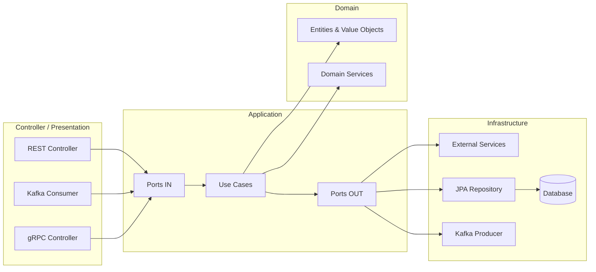

# Diseño de Software

## Capas
```text
controller
application
domain
infrastructure
```



### 🧩 Controller / Presentation
Responsabilidad:
* Recibir peticiones (HTTP / Kafka)
* Validar formato
* Mapear DTOs

```text
controller
 ├── rest
 │    ├── dto
 │    └── mapper
 ├── kafka
 │    ├── event
 │    └── mapper
 └── grpc
      └── mapper
```

### 🧠 Application (casos de uso)
Responsabilidad:
* Orquestar el flujo
* Gestionar transacciones
* Llamar a dominio
* Emitir eventos

```text
application
 ├── usecase
 ├── mapper
 ├── command
 ├── result
 └── port
      ├── out
      └── in
```

* `mapper` → transforma Command → Domain (VO/Entity)
* `command` → encapsula la intención de la operación
* `result` → lo que devuelve el UseCase
* `port` → interfaces que conectan dependencias externas. **In** a *Controller* y **Out** a *Infrastructure*

### 🧱 Domain
Responsabilidad:
* Reglas de negocio
* Value Objects, pueden contener logica de validacion
* Decisiones importantes

```text
domain
 ├── model
 ├── service
 └── exception
```

### 🔌 Infrastructure
Responsabilidad:
* Implementar repositorios
* Kafka producers/consumers
* APIs externas
* JPA, config, etc.

```text
infrastructure
 ├── persistence
 │    ├── jpa
 │    └── entity
 ├── messaging
 │    └── producer
 │         └── event
 ├── client
 └── config
```

## 🧪 Estrategia general de tests
Testea comportamiento, no implementación. Cada capa se testea aislada, con mocks solo donde toca.

| Capa       | Tipo de test        | Qué NO usar       | Regla mental                     |
| ---------- | ------------------- | ----------------- | -------------------------------- |
| Domain     | Unit test puro      | Spring, mocks, DB | muchos tests, cero mocks         |
| UseCase    | Unit test con mocks | JPA, H2, Kafka    | tests de flujo, mocks de ports   |
| Infra      | Integration test    | Mocks             | pocos tests, tecnología real     |
| Controller | Unit / WebMvcTest   | Dominio real      | entrada / salida                 |
